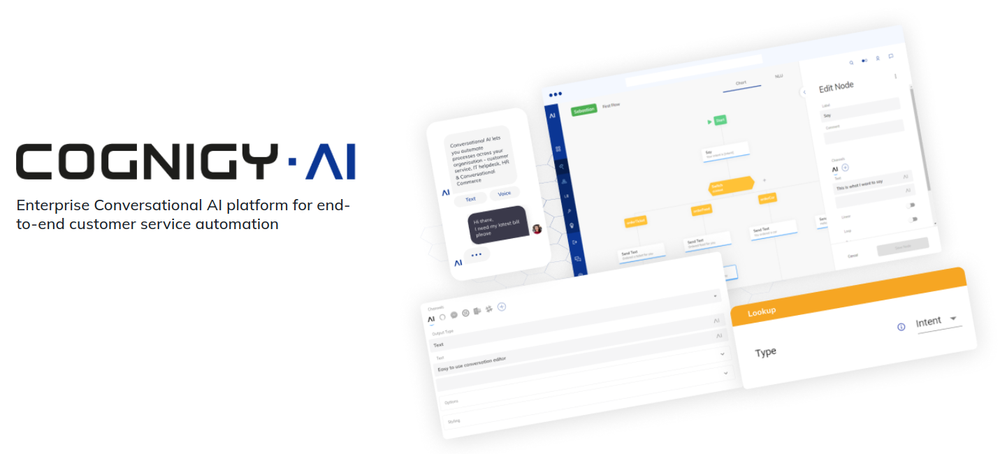

# Cognigy Monitoring Stack Helm Chart
This chart installs Cognigy Monitoring Stack which is based on [kube-prometheus-stack](https://github.com/prometheus-community/helm-charts/tree/main/charts/kube-prometheus-stack)

## Prerequisites
1. Kubernetes cluster running one or more of [Cognigy Products](https://github.com/orgs/Cognigy/repositories) 
2. `kubectl` and `helm` utilities connected to the Kubernetes cluster in administrative mode.
3. Kubernetes, kubectl and Helm versions as specified in [Version Compatibility Matrix](https://docs.cognigy.com/ai/installation/version-compatibility-matrix/).

## Installation
1. To deploy a Helm Release for Monitoring Stack you need to create a separate file with Helm release values. You can use `values_prod.yaml` as a baseline, we recommend to start with it. Make a copy of `values_prod.yaml` into a new file and name it accordingly, we refer to it as `YOUR_VALUES_FILE.yaml` later in this document.
2. Set the essential parameters in `YOUR_VALUES_FILE.yaml`, see the comments inside the file.
3. Install Monitoring Stack Helm Release:
* Installing from Cognigy Container Registry (recommended), specify proper `HELM_CHART_VERSION` (check [CHANGELOG](CHANGELOG.md) for details) and `YOUR_VALUES_FILE.yaml`:
   * Login into Cognigy helm registry (provide your Cognigy Container Registry credentials):
   ```shell
   helm registry login cognigy.azurecr.io \
   --username <your-username> \
   --password <your-password>
   ```
   * Install Helm Chart into a separate `monitoring` namespace:
   ```shell
   helm upgrade --install --create-namespace -n monitoring monitoring-stack oci://cognigy.azurecr.io/helm/cognigy-monitoring --version HELM_CHART_VERSION --values YOUR_VALUES_FILE.yaml
   ```
* Alternatively you can install it from the local chart (not recommended):
   ```shell
   helm upgrade --install --create-namespace -n monitoring monitoring-stack ./cognigy-monitoring --values YOUR_VALUES_FILE.yaml 
   ```
4. If Grafana ingress is disabled you can access the grafana directly by using kubectl port-forwarding: `kubectl port-forward svc/monitoring-stack-grafana 3000:80`. Then access Grafana via `http://localhost:3000`. Use Grafana credentials you have set in `YOUR_VALUES_FILE.yaml`
5. If Grafana ingress is enabled, add Grafana hostname to DNS and access Grafana via browser.
6. Enable Prometheus Monitors for Cognigy products in respective Helm Charts:
   - For [MongoDB Helm Chart](https://github.com/Cognigy/cognigy-mongodb-helm-chart/tree/master/charts/bitnami/mongodb) set `metrics.serviceMonitor.enabled: true` in `values.yaml` of MongoDB Helm Release.
   - For [Cognigy.AI Helm Chart](https://github.com/Cognigy/cognigy-ai-helm-chart) set `podMonitors.enabled: true` and `podMonitors.namespace: "monitoring"` in `values.yaml` of Cognigy.AI Helm Release.
   - For [Live Agent Helm Chart](https://github.com/Cognigy/cognigy-live-agent-helm-chart) set `monitoring.enabled: true` in `values.yaml` of Cognigy LA Helm Release.
   - For [Voice Gateway Helm Chart](https://github.com/Cognigy/cognigy-vg-helm-chart) set `podMonitors.enabled: true` and `podMonitors.namespace: "monitoring"` in `values.yaml` of Cognigy VG Helm Release.
   - To enable additional `ServiceMonitor` for databases and backends included as dependencies in the Cognigy Helm Charts (AI, LA, VG) enable `serviceMonitor` according to the `values.yaml` of the respective Chart.

## Upgrading Chart

```console
helm upgrade -n monitoring monitoring-stack oci://cognigy.azurecr.io/helm/cognigy-monitoring --version HELM_CHART_VERSION --values YOUR_VALUES_FILE.yaml
```

### From 1.22.x to 1.23.x

This update includes breaking changes. Check [here](upgrade/upgrade-1.23.md) for detail instruction.

## Upgrading from legacy Monitoring Stack
To upgrade from our legacy Monitoring stack, check [upgrade from legacy stack](upgrade-from-legacy.md) guide.

## Uninstalling and Clean-up
To uninstall the monitoring stack execute following steps.
**IMPORTANT: all objects in monitoring namespace and Prometheus CRDs will be lost! If you have other objects in monitoring namespace created, make sure you have a corresponding backup!**

1. To remove the monitoring stack execute:
```shell
helm uninstall -n monitoring monitoring-stack
kubectl delete namespace monitoring
kubectl delete MutatingWebhookConfiguration monitoring-stack-kubeproms-admission
kubectl delete validatingwebhookconfigurations.admissionregistration.k8s.io monitoring-stack-kubeproms-admission
```
2. (Optionally): For a complete clean-up, delete kube-prometheus-stack CRDs:
```shell
kubectl delete crd alertmanagerconfigs.monitoring.coreos.com
kubectl delete crd alertmanagers.monitoring.coreos.com
kubectl delete crd podmonitors.monitoring.coreos.com
kubectl delete crd probes.monitoring.coreos.com
kubectl delete crd prometheuses.monitoring.coreos.com
kubectl delete crd prometheusrules.monitoring.coreos.com
kubectl delete crd servicemonitors.monitoring.coreos.com
kubectl delete crd thanosrulers.monitoring.coreos.com
```

