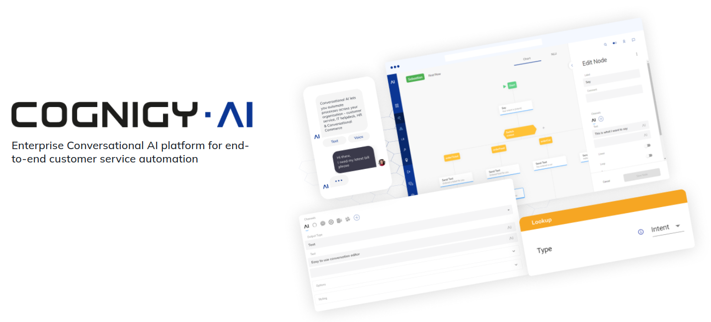

# Cognigy Monitoring Stack Helm Chart
This chart installs Cognigy Monitoring Stack which is based on [kube-prometheus-stack](https://github.com/prometheus-community/helm-charts/tree/main/charts/kube-prometheus-stack)

## Prerequisites
1. Kubernetes cluster running one or more of [Cognigy Products](https://github.com/orgs/Cognigy/repositories)
2. `kubectl` and `helm` utilities connected to the Kubernetes cluster in administrative mode.
3. Kubernetes, kubectl and Helm versions as specified in [Version Compatibility Matrix](https://docs.cognigy.com/ai/installation/version-compatibility-matrix/).

## Installation
1. To deploy a Helm Release for Monitoring Stack you need to create a separate file with Helm release values. You can use `values_prod.yaml` as a baseline, we recommend to start with it. Make a copy of `values_prod.yaml` into a new file and name it accordingly, we refer to it as `YOUR_VALUES_FILE.yaml` later in this document.
2. Set the essential parameters in `YOUR_VALUES_FILE.yaml`, see the comments inside the file.
3. Create the `monitoring` namespace.
   ```shell
   kubectl create namespace monitoring
   ```
4. Create a [`docker-registry`](https://kubernetes.io/docs/tasks/configure-pod-container/pull-image-private-registry/) type secret to pull the images from Cognigy container registry and name it as `cognigy-registry-token`. Provide your Cognigy container registry credentials.
   ```shell
   kubectl create secret docker-registry cognigy-registry-token \
     --namespace=monitoring \
     --docker-server=cognigy.azurecr.io \
     --docker-username=<your-username> \
     --docker-password=<your-password>
   ```
5. Install Monitoring Stack Helm Release:
   * Installing from Cognigy Container Registry (recommended), specify proper `HELM_CHART_VERSION` (check [CHANGELOG](CHANGELOG.md) for details) and `YOUR_VALUES_FILE.yaml`:
      * Login into Cognigy helm registry (provide your Cognigy Container Registry credentials):
         ```shell
         helm registry login cognigy.azurecr.io \
           --username <your-username> \
           --password <your-password>
         ```
      * Install Helm Chart into a separate `monitoring` namespace:
         ```shell
         helm upgrade --install --create-namespace -n monitoring monitoring-stack oci://cognigy.azurecr.io/helm/cognigy-monitoring --version HELM_CHART_VERSION --values YOUR_VALUES_FILE.yaml
         ```
   * Alternatively you can install it from the local chart (not recommended):
      ```shell
      helm upgrade --install --create-namespace -n monitoring monitoring-stack ./cognigy-monitoring --values YOUR_VALUES_FILE.yaml
      ```
6. If Grafana ingress is disabled you can access the grafana directly by using kubectl port-forwarding: `kubectl port-forward svc/monitoring-stack-grafana 3000:80`. Then access Grafana via `http://localhost:3000`. Use Grafana credentials you have set in `YOUR_VALUES_FILE.yaml`
7. If Grafana ingress is enabled, add Grafana hostname to DNS and access Grafana via browser.
8. If the storage class is not specified in `YOUR_VALUES_FILE.yaml`, set: `kubepromstack.prometheus.prometheusSpec.storageSpec.volumeClaimTemplate.spec.storageClassName: prometheus` in the `YOUR_VALUES_FILE.yaml` file. **Note: The storage class must be deployed before the Helm chart.**
9. Enable Prometheus Monitors for Cognigy products in respective Helm Charts:
   - For [MongoDB Helm Chart](https://github.com/Cognigy/cognigy-mongodb-helm-chart/tree/master/charts/bitnami/mongodb) set `metrics.serviceMonitor.enabled: true` in `values.yaml` of MongoDB Helm Release.
   - For [Cognigy.AI Helm Chart](https://github.com/Cognigy/cognigy-ai-helm-chart) set `podMonitors.enabled: true`, `redisHa.metrics.serviceMonitor.enabled: true` and `redisPersistentHa.metrics.serviceMonitor.enabled: true` in `values.yaml` of Cognigy.AI Helm Release.
   - For [Live Agent Helm Chart](https://github.com/Cognigy/cognigy-live-agent-helm-chart) set `monitoring.enabled: true` in `values.yaml` of Cognigy LA Helm Release.
   - For [Voice Gateway Helm Chart](https://github.com/Cognigy/cognigy-vg-helm-chart) set `podMonitors.enabled: true` and `podMonitors.namespace: "monitoring"` in `values.yaml` of Cognigy VG Helm Release.
   - To enable additional `ServiceMonitor` for databases and backends included as dependencies in the Cognigy Helm Charts (AI, LA, VG) enable `serviceMonitor` according to the `values.yaml` of the respective Chart.

## Azure Load Balancer monitoring (Promitor)

The chart can optionally deploy [Promitor](https://promitor.io/) to pull Azure Monitor metrics for Azure Load Balancers into Prometheus.

### Prerequisites
1. Create an Azure Service Principal with **Reader** on the target subscription:
   ```shell
   az ad sp create-for-rbac \
     --name cognigy-monitoring-promitor \
     --role Reader \
     --scopes /subscriptions/<YOUR_SUBSCRIPTION_ID>
   ```
   Note the returned `appId`, `password`, and `tenant`. The `password` is shown only once.
2. Grant the SP **Monitoring Reader** on the same subscription (Reader alone returns empty metrics):
   ```shell
   az role assignment create \
     --assignee <APP_ID> \
     --role "Monitoring Reader" \
     --scope /subscriptions/<YOUR_SUBSCRIPTION_ID>
   ```
3. Create the SP-password Secret in the `monitoring` namespace of the target cluster.
   ```shell
   kubectl create secret generic promitor-azure-credentials \
     --namespace=monitoring \
     --from-literal=azure-app-key='<SP_APP_KEY_PASSWORD>'
   ```
   The Secret's name (`promitor-azure-credentials`) and data-key (`azure-app-key`) match the defaults in the chart's `promitorDiscovery.secrets` / `promitorScraper.secrets` reference block. If you use a different name or data-key, override both `promitorDiscovery.secrets.secretName` (and `promitorScraper.secrets.secretName`) — they must stay in lock-step.

### Enable in monitoring stack
1. In `YOUR_VALUES_FILE.yaml` (your copy of `values_prod.yaml`), edit the `promitorDiscovery` block:
   ```yaml
   promitorDiscovery:
     enabled: &promitorEnabled true                          # flag to enable/disable
     azureAuthentication:
       identity:
         id: &promitorAppId "<SP_APP_ID>"                    # Service Principal appId
     azureLandscape:
       tenantId: &promitorTenantId "<AAD_TENANT_ID>"         # AAD tenant
       subscriptions:
         - &promitorSubscriptionId "<SUBSCRIPTION_ID>"       # subscription that owns this AKS
   ```
2. Install / upgrade the Helm release.
   ```shell
   helm upgrade --install -n monitoring monitoring-stack \
     oci://cognigy.azurecr.io/helm/cognigy-monitoring \
     --version HELM_CHART_VERSION \
     --values YOUR_VALUES_FILE.yaml
   ```
3. Verify the agents:
   ```shell
   kubectl -n monitoring rollout status deploy/promitor-discovery
   kubectl -n monitoring rollout status deploy/promitor-scraper
   kubectl -n monitoring port-forward svc/promitor-scraper 8888:8888
   curl -s http://localhost:8888/metrics | grep '^azure_lb_' | head
   ```
4. In Prometheus, confirm the `promitor-scraper` target is **UP** under **Status → Targets**.

## Upgrading Chart

```console
helm upgrade -n monitoring monitoring-stack oci://cognigy.azurecr.io/helm/cognigy-monitoring --version HELM_CHART_VERSION --values YOUR_VALUES_FILE.yaml
```

### From 1.22.x to 1.23.x

This update includes breaking changes. Check [here](upgrade/upgrade-1.23.md) for detail instruction.

### From 1.30.x to 1.31.x

This update requires additional steps. Check [here](upgrade/upgrade-1.31.md) for detail instruction.

### From 1.31.x to 2026.1.x
Starting from this release all the images are pulled from the Cognigy container registry. Before deploying this release, create a [`docker-registry`](https://kubernetes.io/docs/tasks/configure-pod-container/pull-image-private-registry/) type secret to pull the images from Cognigy container registry and name it as `cognigy-registry-token`. Provide your Cognigy container registry credentials.

```shell
kubectl create secret docker-registry cognigy-registry-token \
   --namespace=monitoring
   --docker-server=cognigy.azurecr.io \
   --docker-username=<your-username> \
   --docker-password=<your-password>
```

## Upgrading from legacy Monitoring Stack
To upgrade from our legacy Monitoring stack, check [upgrade from legacy stack](upgrade-from-legacy.md) guide.

## Uninstalling and Clean-up
To uninstall the monitoring stack execute following steps.
**IMPORTANT: all objects in monitoring namespace and Prometheus CRDs will be lost! If you have other objects in monitoring namespace created, make sure you have a corresponding backup!**

1. To remove the monitoring stack execute:
   ```shell
   helm uninstall -n monitoring monitoring-stack
   kubectl delete namespace monitoring
   kubectl delete MutatingWebhookConfiguration monitoring-stack-kubeproms-admission
   kubectl delete validatingwebhookconfigurations.admissionregistration.k8s.io monitoring-stack-kubeproms-admission
   ```
2. (Optionally): For a complete clean-up, delete kube-prometheus-stack CRDs:
   ```shell
   kubectl delete crd alertmanagerconfigs.monitoring.coreos.com
   kubectl delete crd alertmanagers.monitoring.coreos.com
   kubectl delete crd podmonitors.monitoring.coreos.com
   kubectl delete crd probes.monitoring.coreos.com
   kubectl delete crd prometheuses.monitoring.coreos.com
   kubectl delete crd prometheusrules.monitoring.coreos.com
   kubectl delete crd servicemonitors.monitoring.coreos.com
   kubectl delete crd thanosrulers.monitoring.coreos.com
   ```

